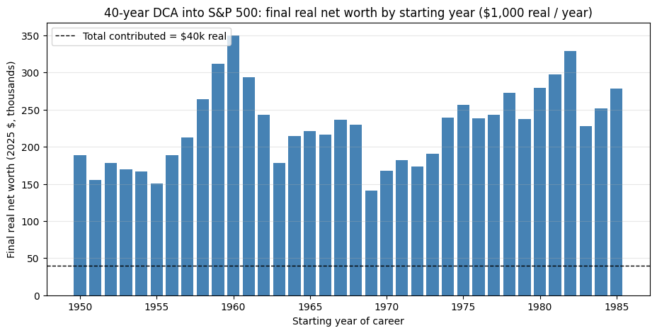
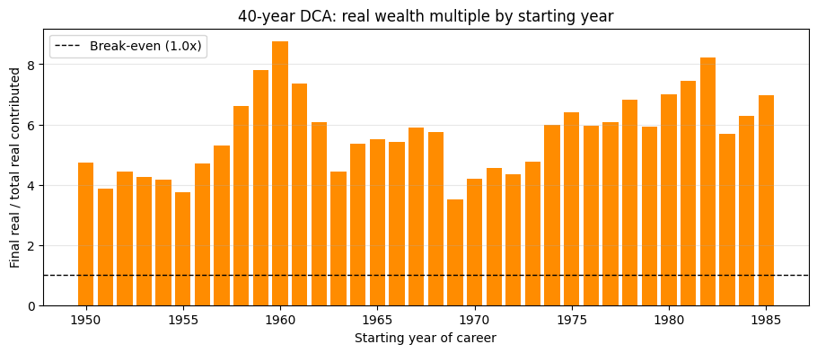
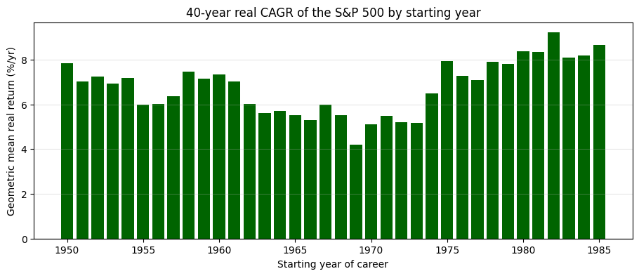
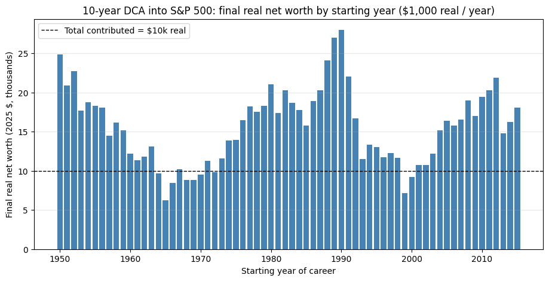
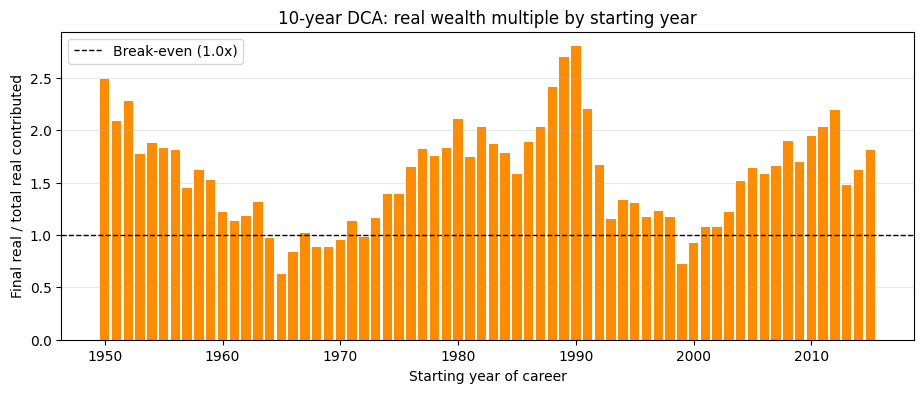
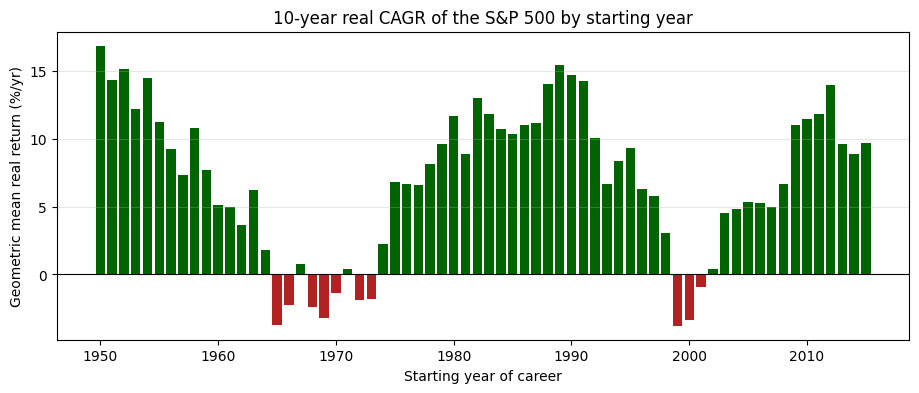

A worker starts saving at age 25, puts away the equivalent of \$1,000/year (in constant
purchasing power) into an S&P 500 index fund, and keeps it up for 40 years. How much
real wealth does she have at age 65? It depends almost entirely on **the calendar
year she happened to start**.

This post runs the experiment for every starting cohort from 1950 to 1985 (a
40-year career ending by 2024 at the latest), and a shorter 10-year version for every
starting cohort from 1950 to 2015. Each cohort contributes the same real \$1,000 per
year, so the only thing that varies is the sequence of returns and inflation they
lived through. Final net worth is reported in 2025-equivalent dollars.

**Data sources**

- S&P 500 annual total returns (price + reinvested dividends), 1928–2025:
  [Damodaran "Historical Returns on Stocks, Bonds and Bills"](https://pages.stern.nyu.edu/~adamodar/New_Home_Page/datafile/histretSP.html).
- Annual CPI inflation, FRED `CPIAUCNS` (republished in the same Damodaran workbook).

All simulation and plotting code lives in [`dca.py`](dca.py); the raw historical
series is in [`historical_returns.csv`](historical_returns.csv).

## Method

Each cohort contributes \$1,000 in **real** (constant) dollars at the start of every
career year. Working in real terms is equivalent to inflating the contribution and
deflating the final value: the real return each year is

$$r_{real} = \frac{1 + r_{nominal}}{1 + \pi} - 1$$

and the final real net worth after $N$ years is

$$W_N = \sum_{k=0}^{N-1} 1000 \cdot \prod_{j=k}^{N-1} (1 + r_{real,\, Y+j})$$

where $Y$ is the cohort's first career year. The dashed line on each chart marks
the total amount contributed in real dollars (\$40,000 for a 40-year career,
\$10,000 for a 10-year career) — anything above it is real investment gain.

## 40-year careers: starting 1950 through 1985

     start_year  end_year final_real_net_worth multiple_of_contributed real_cagr
           1950      1989             $189,159                   4.73x     7.85%
           1951      1990             $154,975                   3.87x     7.04%
           1952      1991             $177,909                   4.45x     7.25%
           1953      1992             $169,718                   4.24x     6.94%
           1954      1993             $167,035                   4.18x     7.18%
           1955      1994             $150,050                   3.75x     5.99%
           1956      1995             $188,369                   4.71x     6.03%
           1957      1996             $212,505                   5.31x     6.37%
           1958      1997             $263,940                   6.60x     7.46%
           1959      1998             $312,148                   7.80x     7.16%
           1960      1999             $349,918                   8.75x     7.34%
           1961      2000             $293,800                   7.35x     7.03%
           1962      2001             $242,773                   6.07x     6.04%
           1963      2002             $177,857                   4.45x     5.60%
           1964      2003             $214,206                   5.36x     5.71%
           1965      2004             $220,912                   5.52x     5.52%
           1966      2005             $216,254                   5.41x     5.30%
           1967      2006             $236,052                   5.90x     5.98%
           1968      2007             $229,885                   5.75x     5.53%
           1969      2008             $140,890                   3.52x     4.19%
           1970      2009             $167,621                   4.19x     5.11%
           1971      2010             $182,466                   4.56x     5.48%
           1972      2011             $173,543                   4.34x     5.19%
           1973      2012             $190,184                   4.75x     5.17%
           1974      2013             $239,115                   5.98x     6.50%
           1975      2014             $256,554                   6.41x     7.94%
           1976      2015             $237,869                   5.95x     7.29%
           1977      2016             $243,321                   6.08x     7.08%
           1978      2017             $272,570                   6.81x     7.92%
           1979      2018             $237,260                   5.93x     7.82%
           1980      2019             $279,597                   6.99x     8.37%
           1981      2020             $297,732                   7.44x     8.35%
           1982      2021             $328,832                   8.22x     9.21%
           1983      2022             $227,797                   5.69x     8.10%
           1984      2023             $251,565                   6.29x     8.19%
           1985      2024             $278,227                   6.96x     8.66%

### What stands out

- **Best cohort:** the worker who started in **1982** retires with the largest
  inflation-adjusted nest egg — they caught the 1982–2000 bull market entirely
  in the accumulation phase, with the biggest contributions invested earliest.
- **Worst cohort:** the worker who started in **1969** does the worst — they
  retired in 2008 right into the GFC and their career covered the 1970s
  stagflation. They still came out ahead, but only by about **3.5×** their
  real contributions (\$141k on \$40k contributed), vs. **8.2×** for the lucky
  cohort.
- **Range:** the best 40-year cohort accumulates roughly **2.3× more** real
  wealth than the worst, off the same real saving rate. Same discipline, same
  index, same plan — pure timing.
- **The middle is wide too.** Cohorts that retired into 2000 or 2008 (started
  in 1961 and 1969 respectively) gave back a chunk of their accumulated wealth
  in the last year of their career — a reminder that "average historical return"
  is not the same as the return *you actually get*.

## 10-year horizons: starting 1950 through 2015

A 10-year window is short enough that the *sequence* of returns dominates: there
are not enough years for compounding to wash out a bad decade. The dispersion
across cohorts gets much wider, and several cohorts end up with **less real wealth
than they contributed**.

     start_year  end_year final_real_net_worth multiple_of_contributed real_cagr
           1950      1959              $24,865                   2.49x    16.86%
           1951      1960              $20,900                   2.09x    14.31%
           1952      1961              $22,758                   2.28x    15.17%
           1953      1962              $17,685                   1.77x    12.16%
           1954      1963              $18,738                   1.87x    14.51%
           1955      1964              $18,288                   1.83x    11.26%
           1956      1965              $18,064                   1.81x     9.27%
           1957      1966              $14,477                   1.45x     7.31%
           1958      1967              $16,163                   1.62x    10.83%
           1959      1968              $15,204                   1.52x     7.67%
           1960      1969              $12,191                   1.22x     5.09%
           1961      1970              $11,328                   1.13x     5.00%
           1962      1971              $11,835                   1.18x     3.65%
           1963      1972              $13,096                   1.31x     6.21%
           1964      1973               $9,672                   0.97x     1.79%
           1965      1974               $6,252                   0.63x    -3.74%
           1966      1975               $8,415                   0.84x    -2.29%
           1967      1976              $10,181                   1.02x     0.74%
           1968      1977               $8,808                   0.88x    -2.44%
           1969      1978               $8,819                   0.88x    -3.21%
           1970      1979               $9,518                   0.95x    -1.35%
           1971      1980              $11,292                   1.13x     0.42%
           1972      1981               $9,842                   0.98x    -1.91%
           1973      1982              $11,618                   1.16x    -1.81%
           1974      1983              $13,892                   1.39x     2.22%
           1975      1984              $13,935                   1.39x     6.78%
           1976      1985              $16,446                   1.64x     6.64%
           1977      1986              $18,219                   1.82x     6.56%
           1978      1987              $17,559                   1.76x     8.18%
           1979      1988              $18,264                   1.83x     9.62%
           1980      1989              $21,054                   2.11x    11.65%
           1981      1990              $17,397                   1.74x     8.91%
           1982      1991              $20,279                   2.03x    12.99%
           1983      1992              $18,685                   1.87x    11.82%
           1984      1993              $17,798                   1.78x    10.74%
           1985      1994              $15,812                   1.58x    10.37%
           1986      1995              $18,907                   1.89x    10.99%
           1987      1996              $20,267                   2.03x    11.14%
           1988      1997              $24,071                   2.41x    14.02%
           1989      1998              $26,976                   2.70x    15.44%
           1990      1999              $27,987                   2.80x    14.69%
           1991      2000              $22,041                   2.20x    14.26%
           1992      2001              $16,708                   1.67x    10.05%
           1993      2002              $11,512                   1.15x     6.63%
           1994      2003              $13,368                   1.34x     8.39%
           1995      2004              $13,010                   1.30x     9.29%
           1996      2005              $11,737                   1.17x     6.30%
           1997      2006              $12,284                   1.23x     5.75%
           1998      2007              $11,690                   1.17x     3.08%
           1999      2008               $7,185                   0.72x    -3.78%
           2000      2009               $9,201                   0.92x    -3.39%
           2001      2010              $10,739                   1.07x    -0.93%
           2002      2011              $10,738                   1.07x     0.39%
           2003      2012              $12,186                   1.22x     4.51%
           2004      2013              $15,143                   1.51x     4.85%
           2005      2014              $16,379                   1.64x     5.37%
           2006      2015              $15,792                   1.58x     5.30%
           2007      2016              $16,553                   1.66x     4.99%
           2008      2017              $18,967                   1.90x     6.70%
           2009      2018              $16,968                   1.70x    10.98%
           2010      2019              $19,414                   1.94x    11.48%
           2011      2020              $20,316                   2.03x    11.81%
           2012      2021              $21,920                   2.19x    13.96%
           2013      2022              $14,802                   1.48x     9.58%
           2014      2023              $16,228                   1.62x     8.87%
           2015      2024              $18,070                   1.81x     9.69%

### What stands out

- **Underwater cohorts.** Decades starting in **1964–1972** (stagflation) and
  in **1999–2000** (dot-com bust into GFC) finish *below* \$10,000 of real
  contributions — the only thing that saved them was that they were still
  working, not retiring. The 1965 cohort retired with **\$6,252** in real
  dollars after contributing \$10,000 — a 37% real loss over a decade.
- **Best 10-year window:** starting in **1988–1990** (catching the dot-com
  run-up) or **1950–1952** (the post-war bull) more than doubled the
  contributions in real terms over a single decade.
- **Real CAGR ranges from roughly –4%/yr to +17%/yr** depending on which decade
  you got. Compound that over a career and you get the dispersion we saw above.

## Takeaways

1. **Sequence-of-returns risk is real and large, even for buy-and-hold index investors.**
   The same disciplined \$1,000/year real saver retires with anywhere from
   roughly \$140k to \$330k in 2025 dollars depending purely on which year they
   happened to start their career. Holding the index is necessary; it is not
   sufficient to guarantee a particular outcome.
2. **40 years smooths a lot, but not everything.** The 40-year real CAGRs range
   from ~4%/yr (cohorts who started just before the 1970s stagflation) to
   ~9%/yr (cohorts who started just before the long 1982–2000 bull). Compounded
   over a career that 5pp gap is a factor-of-2+ difference in retirement wealth.
3. **10-year windows can lose money in real terms.** Several decade-long cohorts
   end up with *less* purchasing power than they contributed. This is why
   target-date funds and bond ladders exist for people who are 10 years from
   retirement — the equity premium is an asymptotic statement, not a guarantee
   over short horizons.
4. **The lesson is not "time the market" — it's "extend the horizon."**
   You cannot pick your starting year, but you can pick how long you stay
   invested. Going from 10 years to 40 years compresses the dispersion of
   outcomes dramatically (and shifts the whole distribution up).

## Sources

- [Aswath Damodaran — Historical Returns on Stocks, Bonds and Bills (NYU Stern)](https://pages.stern.nyu.edu/~adamodar/New_Home_Page/datafile/histretSP.html)
- [FRED — CPI for All Urban Consumers: All Items (CPIAUCNS)](https://fred.stlouisfed.org/series/CPIAUCNS)
- [Shiller, Robert J. — Online Data (Irrational Exuberance)](http://www.econ.yale.edu/~shiller/data.htm) (cross-check)

---

*The analysis above is generated by [`sp500_dca.ipynb`](https://github.com/ericbusboom/explainers/blob/master/content/posts/sp500-dca/sp500_dca.ipynb), with the simulation and plotting code in [`dca.py`](https://github.com/ericbusboom/explainers/blob/master/content/posts/sp500-dca/dca.py) in the same directory. View on GitHub to inspect or run.*
