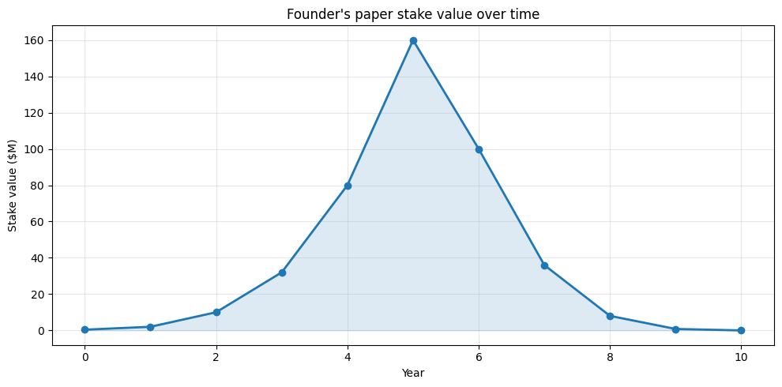
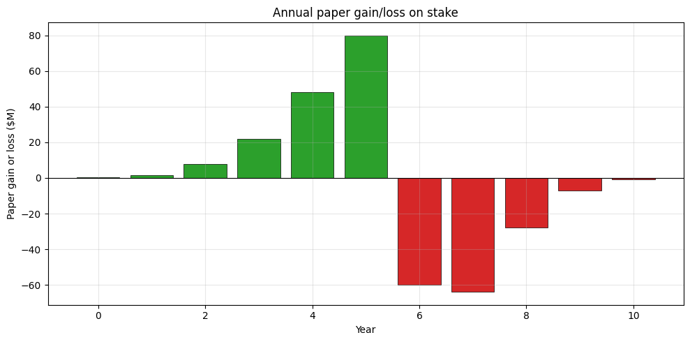
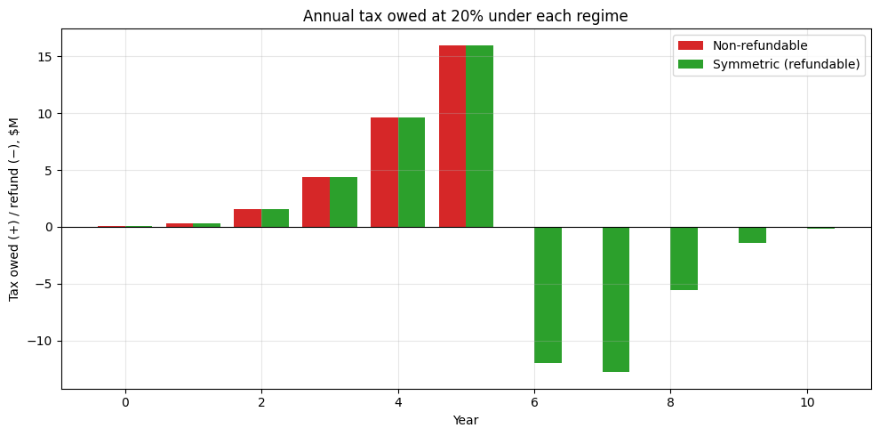
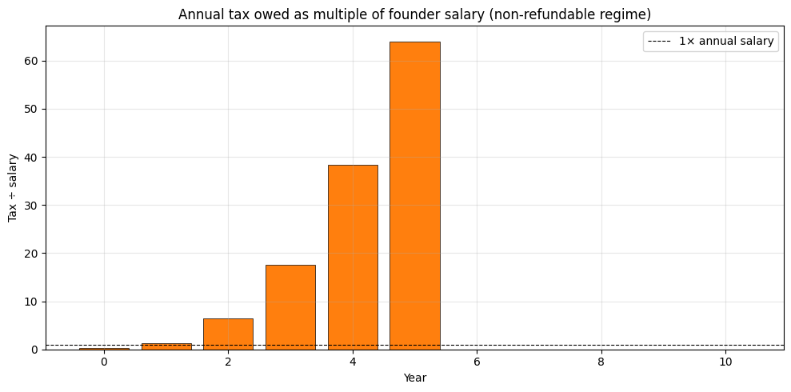

**Scenario.** A founder starts a company. Her shares are worth essentially nothing on day 1 (her cost basis). The company raises money, the implied valuation climbs, and by year 5 her stake is paper-worth tens of millions of dollars. Then the business fails, and by year 8 the stock is worthless.

Under a 20% annual mark-to-market tax on unrealized capital gains, what does her tax bill look like, year by year?

We model two regimes:

1. **Non-refundable** — paper gains are taxed every year; paper losses get a credit only against future paper gains. If the company goes to zero, leftover loss carryforwards are worthless.
2. **Symmetric (refundable)** — paper losses generate an immediate refund at the same 20% rate. The IRS pays you in down years.

Both regimes have problems. The first creates **liquidity crises and net negative outcomes** for failed founders. The second turns the Treasury into a co-investor that writes checks during recessions — politically and fiscally implausible.

## Year-by-year simulation

<table border="1" class="dataframe">
  <thead>
    <tr style="text-align: right;">
      <th></th>
      <th>year</th>
      <th>company_valuation</th>
      <th>stake_value</th>
      <th>annual_gain</th>
      <th>tax_nonref</th>
      <th>tax_symmetric</th>
      <th>salary</th>
      <th>cum_tax_nonref</th>
      <th>cum_tax_symmetric</th>
      <th>tax_vs_salary</th>
    </tr>
  </thead>
  <tbody>
    <tr>
      <th>0</th>
      <td>0</td>
      <td>1000000</td>
      <td>400000.0</td>
      <td>390000.0</td>
      <td>78000.0</td>
      <td>78000.0</td>
      <td>250000</td>
      <td>78000.0</td>
      <td>78000.0</td>
      <td>0.0</td>
    </tr>
    <tr>
      <th>1</th>
      <td>1</td>
      <td>5000000</td>
      <td>2000000.0</td>
      <td>1600000.0</td>
      <td>320000.0</td>
      <td>320000.0</td>
      <td>250000</td>
      <td>398000.0</td>
      <td>398000.0</td>
      <td>1.0</td>
    </tr>
    <tr>
      <th>2</th>
      <td>2</td>
      <td>25000000</td>
      <td>10000000.0</td>
      <td>8000000.0</td>
      <td>1600000.0</td>
      <td>1600000.0</td>
      <td>250000</td>
      <td>1998000.0</td>
      <td>1998000.0</td>
      <td>6.0</td>
    </tr>
    <tr>
      <th>3</th>
      <td>3</td>
      <td>80000000</td>
      <td>32000000.0</td>
      <td>22000000.0</td>
      <td>4400000.0</td>
      <td>4400000.0</td>
      <td>250000</td>
      <td>6398000.0</td>
      <td>6398000.0</td>
      <td>18.0</td>
    </tr>
    <tr>
      <th>4</th>
      <td>4</td>
      <td>200000000</td>
      <td>80000000.0</td>
      <td>48000000.0</td>
      <td>9600000.0</td>
      <td>9600000.0</td>
      <td>250000</td>
      <td>15998000.0</td>
      <td>15998000.0</td>
      <td>38.0</td>
    </tr>
    <tr>
      <th>5</th>
      <td>5</td>
      <td>400000000</td>
      <td>160000000.0</td>
      <td>80000000.0</td>
      <td>16000000.0</td>
      <td>16000000.0</td>
      <td>250000</td>
      <td>31998000.0</td>
      <td>31998000.0</td>
      <td>64.0</td>
    </tr>
    <tr>
      <th>6</th>
      <td>6</td>
      <td>250000000</td>
      <td>100000000.0</td>
      <td>-60000000.0</td>
      <td>0.0</td>
      <td>-12000000.0</td>
      <td>250000</td>
      <td>31998000.0</td>
      <td>19998000.0</td>
      <td>0.0</td>
    </tr>
    <tr>
      <th>7</th>
      <td>7</td>
      <td>90000000</td>
      <td>36000000.0</td>
      <td>-64000000.0</td>
      <td>0.0</td>
      <td>-12800000.0</td>
      <td>250000</td>
      <td>31998000.0</td>
      <td>7198000.0</td>
      <td>0.0</td>
    </tr>
    <tr>
      <th>8</th>
      <td>8</td>
      <td>20000000</td>
      <td>8000000.0</td>
      <td>-28000000.0</td>
      <td>0.0</td>
      <td>-5600000.0</td>
      <td>250000</td>
      <td>31998000.0</td>
      <td>1598000.0</td>
      <td>0.0</td>
    </tr>
    <tr>
      <th>9</th>
      <td>9</td>
      <td>2000000</td>
      <td>800000.0</td>
      <td>-7200000.0</td>
      <td>0.0</td>
      <td>-1440000.0</td>
      <td>250000</td>
      <td>31998000.0</td>
      <td>158000.0</td>
      <td>0.0</td>
    </tr>
    <tr>
      <th>10</th>
      <td>10</td>
      <td>0</td>
      <td>0.0</td>
      <td>-800000.0</td>
      <td>0.0</td>
      <td>-160000.0</td>
      <td>250000</td>
      <td>31998000.0</td>
      <td>-2000.0</td>
      <td>0.0</td>
    </tr>
  </tbody>
</table>

## The headline numbers

    Peak paper value of stake:      $    160,000,000
    Final value of stake:           $              0
    
    Total tax paid, non-refundable: $     31,998,000
    Total tax paid, symmetric:      $         -2,000
    
    Net cash outcome, non-refundable: $    -31,998,000
    Net cash outcome, symmetric:      $          2,000
    
    Worst year (non-refundable): year 5, tax owed $16,000,000
      ...which is 64.0x her annual salary.

## Charts

    

    

    

    

    

    

    

    

    

    

## Takeaways

- In the **non-refundable regime**, the founder pays substantial cash tax during the up years on stock she cannot sell (the company is private and there is no liquid market for her shares). When the company fails, she is left with a worthless stake *and* a worthless pile of loss carryforwards. Her net cash outcome is **strongly negative** even though her realized economic gain is roughly zero.
- In the **symmetric regime**, the math works out: cumulative tax over the cycle equals 20% of (final value − cost basis), which is zero. But this requires the IRS to send her refund checks during the bust years, which no real tax system does at scale.
- The peak-year tax bill is many multiples of her actual salary. To pay it she would have to either: borrow against illiquid private stock (often impossible), sell stock to other investors at the current mark (which depresses the mark and triggers the same problem for everyone else), or have the company itself fund the tax via a special distribution (which starves it of growth capital).

---

*The simulation above is generated by [`entrepreneur.ipynb`](https://github.com/ericbusboom/explainers/blob/master/content/posts/unrealized-gains-tax-entrepreneur/entrepreneur.ipynb). View the notebook on GitHub to inspect or run the code.*
