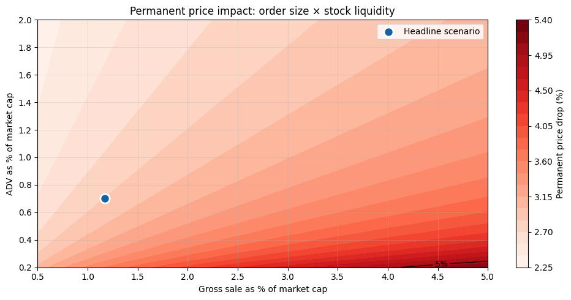
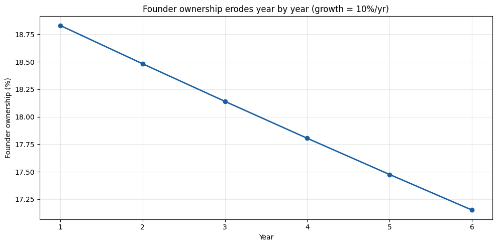

**Scenario.** A founder owns 20% of a publicly traded company with a market cap of \$5B. Over one year the company grows to \$7B. The founder's paper gain is \$400M and a 20% annual mark-to-market tax produces an \$80M cash bill. He has no other liquid wealth — his stake *is* his wealth.

He has to sell stock to pay the tax. The question this notebook tries to answer: **how much of the tax does he actually pay, once you include the price impact of forcing \$80M of insider supply through a stock that trades \$30–\$50M a day?**

Spoiler: the headline 20% tax rate on his paper gain ends up costing closer to 30% — about 1.5× the nominal rate — because every dollar of forced selling permanently lowers the value of the stock he still owns.

## What we use as inputs

Three empirical regularities anchor the model:

1. **Liquidity.** For listed companies in the \$5–10B market-cap range, average daily dollar volume is roughly **0.6%–0.8% of market cap**. (The S&P MidCap 400 now starts at \$8B; a \$5B name is below that band, in the lower-mid / small-cap segment, where turnover is thinner.) We use 0.7% as a baseline.
2. **Daily volatility ~ 2%.** Mid-cap annualized volatility is typically 30–40%, so daily σ = 30%/√252 ≈ 1.9%. We use 2%.
3. **Square-root price impact (Almgren et al. 2005; Said 2022 survey).** A metaorder of size \$Q\$ on a stock with daily volume \$V\$ moves price by approximately
$$\Delta P / P \approx Y \cdot \sigma \cdot \sqrt{Q/V}, \qquad Y \approx 1.$$
   This holds across equities, futures, options, and crypto. The total displacement decomposes into a *temporary* part that decays after the trade and a *permanent* part typically estimated at ~1/3 of the total. For insider sales we add a modest signaling discount (the market knows it is an insider liquidating).
4. **Rule 144 dribble cap.** Insider affiliates can sell at most max(1% of shares outstanding, prior-4-week average weekly volume) per rolling three-month period. We check whether the tax-driven sale even *fits* inside this cap.

## Step 1 — the headline tax bill

    Founder stake at year start:    $  1,000,000,000
    Founder stake at year end:      $  1,400,000,000
    Paper gain on the year:         $    400,000,000
    Tax owed at 20%:                $     80,000,000

## Step 2 — how big is that sale relative to normal trading?

    Average daily dollar volume:      $     49,000,000
    Volume over 60-day horizon:        $  2,940,000,000
    
    Tax bill as % of company:                   1.14%
    Tax bill in days of volume:                   1.6 days
    Tax bill as % of horizon volume:            2.72%
    
    Rule 144 1%-of-shares cap:          $   70,000,000
    Rule 144 weekly-volume cap:         $  245,000,000
    Effective Rule 144 cap (greater):   $  245,000,000
    Tax bill / Rule-144 cap:                       0.33x  (>1 means more than one quarter required)

## Step 3 — predicted price impact under the square-root law

Total impact = mechanical impact from order size + insider signaling. The mechanical piece scales like √(Q/V) per Almgren. The permanent piece is roughly 1/3 of the total — that's what stays in the price after the metaorder finishes. The signaling piece is pure permanent.

    Total price impact during sale:     4.56%
    Permanent component (after sale):   2.84%

## Step 4 — the founder has to sell *more* than the tax to net the tax

If he sells at an average price discounted by ~½ of the total impact (the linear-VWAP approximation: the first share goes off near the top, the last share near the bottom), then he nets `dollars_sold × (1 − total_impact/2)`. To net \$80M he has to sell more than \$80M of stock. We solve for the actual amount.

    Gross stock sold (pre-impact dollars): $     81,877,163
    Net cash received (= tax owed):        $     80,000,000
    Friction (over-selling above the tax): $      1,877,163  (2.3% of the tax)
    Realized total impact during sale:     4.59%
    Realized permanent impact:             2.85%

## Step 5 — the loss on the shares he still holds

After the sale, the permanent impact stays in the stock price. His *remaining* shares are worth permanently less. That value destruction is not on his tax return, but it is the largest hidden cost of this whole exercise.

    Ownership sold to pay tax:           1.17% of the company
    Remaining ownership:                 18.83%
    
    Remaining stake before impact:       $  1,318,122,837
    Remaining stake after impact:        $  1,280,514,767
    Value destroyed on remaining stake:  $     37,608,071

## Step 6 — putting it all together: the real cost vs the headline tax

                             Component      Amount ($)
                 Cash paid to Treasury $    80,000,000
           Sale friction (over-sold $) $     1,877,163
    Value destroyed on remaining stake $    37,608,071
        TOTAL economic cost to founder $   119,485,233
              -- as % of paper gain -- $   119,485,233
    
    Nominal tax rate on paper gain:    20%
    Effective rate (cost / gain):      29.9%
    Hidden multiplier:                 1.49x the nominal rate

## Charts

    

    

    

    

    

    

     Year  Mkt cap end  Ownership  Tax owed  Economic cost
        1       7000.0       18.8      80.0          119.5
        2       7510.2       18.5      26.4           61.9
        3       8057.8       18.1      27.8           65.1
        4       8645.9       17.8      29.2           68.5
        5       9277.2       17.5      30.8           72.1
        6       9955.0       17.2      32.4           75.8

    

    

## Takeaways

1. **The $80M nominal tax bill costs the founder ~$120M in real economic terms** — half again as much as the cash paid to the Treasury. The hidden \$38M is the permanent value destroyed on the ~18.8% stake he still holds after the sale, plus a small sale-friction overshoot.
2. **The effective tax rate on his paper gain is ~30%, not 20%.** And it climbs sharply as the company gets smaller, the founder owns more, or the stock is less liquid — exactly the households the proposal is supposed to target.
3. **Rule 144 doesn't bind for a normally liquid \$5–7B stock** (the weekly-volume cap is roughly \$245M, comfortably above the \$80M sale). But it *does* bind for thinly traded names: cut ADV below ~0.3% of market cap and the founder runs out of legal selling capacity inside one quarter and has to push the sale across multiple quarters.
4. **Other shareholders pay too.** The permanent price drop applies to *everyone* who owns the stock — index funds, pension plans, retail. A wealth tax on the founder is, in part, a value transfer from every other holder of the same security to the Treasury.
5. **Compounding.** If the company keeps growing, the same dance repeats every year. Each year's tax bill forces another insider sale; ownership erodes monotonically. The founder loses control of the company on a fixed schedule independent of business performance.

## Caveats

- The square-root law is a robust empirical regularity but the *coefficient* Y is asset- and venue-specific. Almgren et al. estimate it near 1 for U.S. equities; other authors find Y in the 0.5–1.5 range. The numbers above scale linearly with Y.
- The 2% "insider signaling" permanent discount is a stylized estimate. Pre-announced 10b5-1 plan sales attract a smaller discount; surprise insider supply attracts a larger one.
- We assume the sale is executed cleanly over the chosen horizon. In practice, brokers spread insider blocks via dark pools and accelerated programs to minimize impact — but the *permanent* component is structural and cannot be hidden.

## Sources

- Almgren, R., Thum, C., Hauptmann, E., & Li, H. (2005). Direct estimation of equity market impact. ([PDF](https://www.cis.upenn.edu/~mkearns/finread/costestim.pdf))
- Said, E. (2022). Market Impact: Empirical Evidence, Theory and Practice. ([arXiv 2205.07385](https://arxiv.org/pdf/2205.07385))
- SEC Rule 144 — selling restricted and control securities ([SEC.gov](https://www.sec.gov/reports/rule-144-selling-restricted-control-securities))
- S&P MidCap 400 inclusion thresholds (\$8B–\$22.7B) — S&P Dow Jones Indices.

---

*The simulation above is generated by [`public_company.ipynb`](https://github.com/ericbusboom/explainers/blob/master/content/posts/unrealized-gains-tax-public-company/public_company.ipynb). View the notebook on GitHub to inspect or run the code.*
