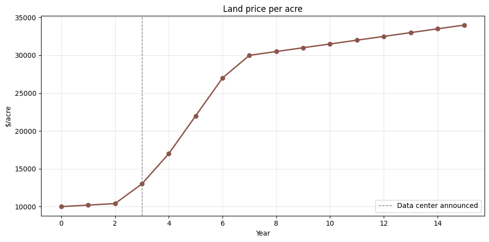
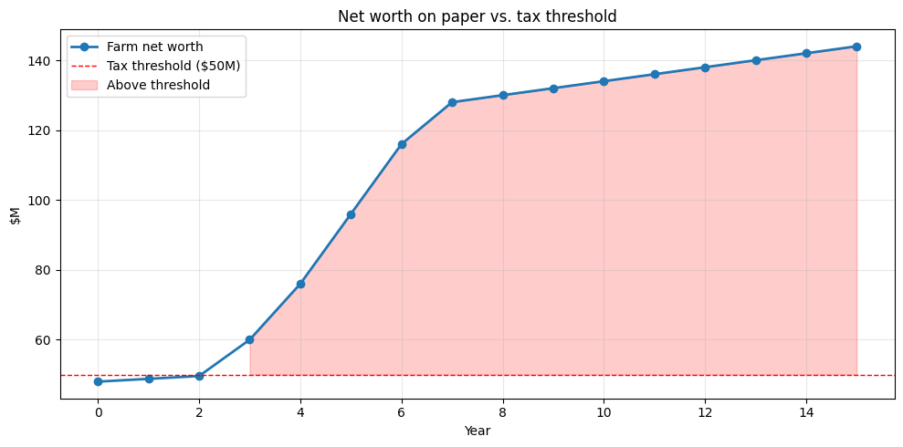
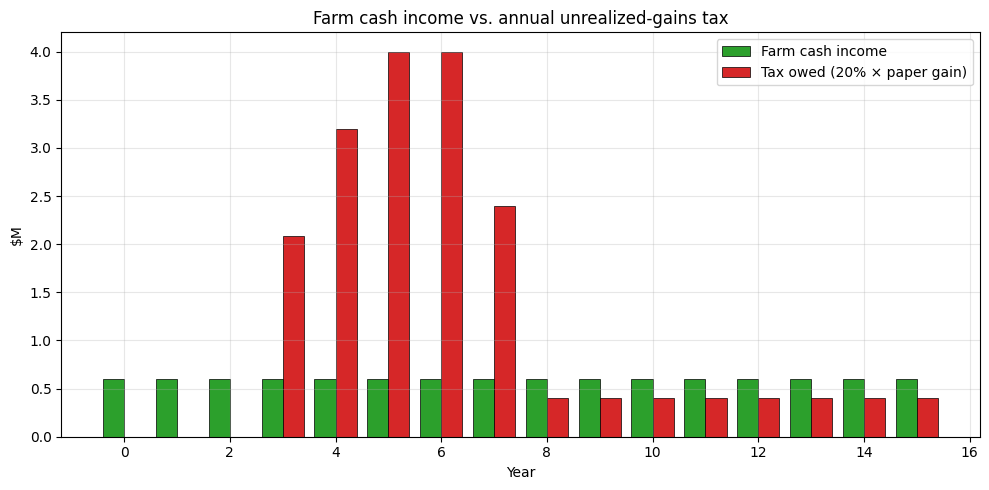
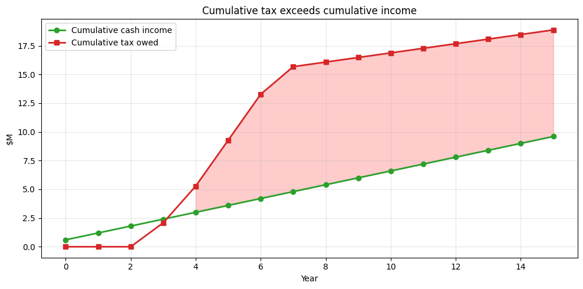
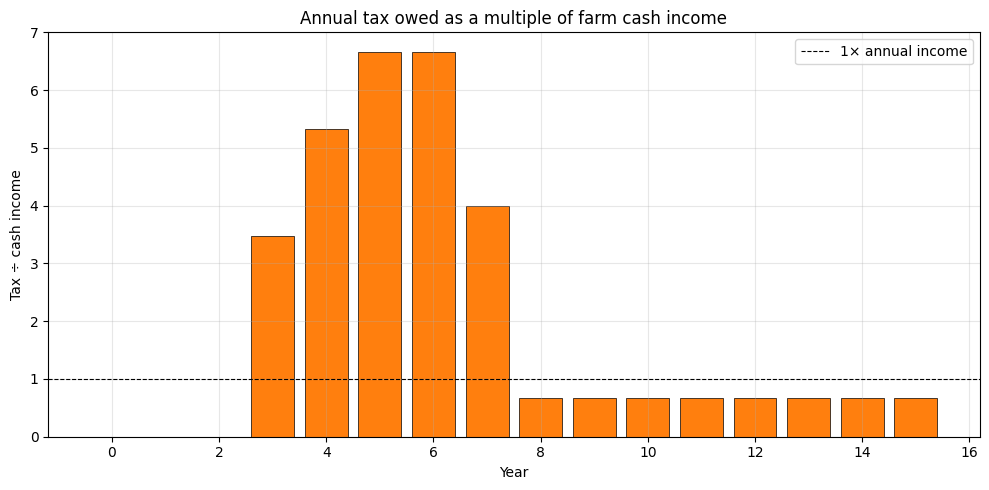

**Scenario.** A family runs a 4,000-acre row-crop operation. The land has been in the family for three generations and is the farm. A hyperscale data-center campus is announced 15 miles away in year 3, and land prices in the county climb sharply over the next several years as developers and speculators buy up parcels.

The farmer's *cash income* hasn't changed — corn and soybeans pay roughly what they did before. But the *paper value* of the farm has tripled. Under a 20% annual mark-to-market tax on unrealized gains for net worth above a threshold (we'll use \$50M, a common figure in wealth-tax proposals), what happens?

## Year-by-year simulation

<table border="1" class="dataframe">
  <thead>
    <tr style="text-align: right;">
      <th></th>
      <th>year</th>
      <th>land_per_acre</th>
      <th>land_value</th>
      <th>net_worth</th>
      <th>above_threshold</th>
      <th>annual_gain</th>
      <th>farm_cash_income</th>
      <th>tax_owed</th>
      <th>cash_after_tax</th>
      <th>tax_vs_income</th>
      <th>cum_tax</th>
      <th>cum_cash_income</th>
    </tr>
  </thead>
  <tbody>
    <tr>
      <th>0</th>
      <td>0</td>
      <td>10000</td>
      <td>40000000</td>
      <td>48000000</td>
      <td>False</td>
      <td>0</td>
      <td>600000.0</td>
      <td>0.0</td>
      <td>600000.0</td>
      <td>0.0</td>
      <td>0.0</td>
      <td>600000.0</td>
    </tr>
    <tr>
      <th>1</th>
      <td>1</td>
      <td>10200</td>
      <td>40800000</td>
      <td>48800000</td>
      <td>False</td>
      <td>800000</td>
      <td>600000.0</td>
      <td>0.0</td>
      <td>600000.0</td>
      <td>0.0</td>
      <td>0.0</td>
      <td>1200000.0</td>
    </tr>
    <tr>
      <th>2</th>
      <td>2</td>
      <td>10400</td>
      <td>41600000</td>
      <td>49600000</td>
      <td>False</td>
      <td>800000</td>
      <td>600000.0</td>
      <td>0.0</td>
      <td>600000.0</td>
      <td>0.0</td>
      <td>0.0</td>
      <td>1800000.0</td>
    </tr>
    <tr>
      <th>3</th>
      <td>3</td>
      <td>13000</td>
      <td>52000000</td>
      <td>60000000</td>
      <td>True</td>
      <td>10400000</td>
      <td>600000.0</td>
      <td>2080000.0</td>
      <td>-1480000.0</td>
      <td>3.0</td>
      <td>2080000.0</td>
      <td>2400000.0</td>
    </tr>
    <tr>
      <th>4</th>
      <td>4</td>
      <td>17000</td>
      <td>68000000</td>
      <td>76000000</td>
      <td>True</td>
      <td>16000000</td>
      <td>600000.0</td>
      <td>3200000.0</td>
      <td>-2600000.0</td>
      <td>5.0</td>
      <td>5280000.0</td>
      <td>3000000.0</td>
    </tr>
    <tr>
      <th>5</th>
      <td>5</td>
      <td>22000</td>
      <td>88000000</td>
      <td>96000000</td>
      <td>True</td>
      <td>20000000</td>
      <td>600000.0</td>
      <td>4000000.0</td>
      <td>-3400000.0</td>
      <td>7.0</td>
      <td>9280000.0</td>
      <td>3600000.0</td>
    </tr>
    <tr>
      <th>6</th>
      <td>6</td>
      <td>27000</td>
      <td>108000000</td>
      <td>116000000</td>
      <td>True</td>
      <td>20000000</td>
      <td>600000.0</td>
      <td>4000000.0</td>
      <td>-3400000.0</td>
      <td>7.0</td>
      <td>13280000.0</td>
      <td>4200000.0</td>
    </tr>
    <tr>
      <th>7</th>
      <td>7</td>
      <td>30000</td>
      <td>120000000</td>
      <td>128000000</td>
      <td>True</td>
      <td>12000000</td>
      <td>600000.0</td>
      <td>2400000.0</td>
      <td>-1800000.0</td>
      <td>4.0</td>
      <td>15680000.0</td>
      <td>4800000.0</td>
    </tr>
    <tr>
      <th>8</th>
      <td>8</td>
      <td>30500</td>
      <td>122000000</td>
      <td>130000000</td>
      <td>True</td>
      <td>2000000</td>
      <td>600000.0</td>
      <td>400000.0</td>
      <td>200000.0</td>
      <td>1.0</td>
      <td>16080000.0</td>
      <td>5400000.0</td>
    </tr>
    <tr>
      <th>9</th>
      <td>9</td>
      <td>31000</td>
      <td>124000000</td>
      <td>132000000</td>
      <td>True</td>
      <td>2000000</td>
      <td>600000.0</td>
      <td>400000.0</td>
      <td>200000.0</td>
      <td>1.0</td>
      <td>16480000.0</td>
      <td>6000000.0</td>
    </tr>
    <tr>
      <th>10</th>
      <td>10</td>
      <td>31500</td>
      <td>126000000</td>
      <td>134000000</td>
      <td>True</td>
      <td>2000000</td>
      <td>600000.0</td>
      <td>400000.0</td>
      <td>200000.0</td>
      <td>1.0</td>
      <td>16880000.0</td>
      <td>6600000.0</td>
    </tr>
    <tr>
      <th>11</th>
      <td>11</td>
      <td>32000</td>
      <td>128000000</td>
      <td>136000000</td>
      <td>True</td>
      <td>2000000</td>
      <td>600000.0</td>
      <td>400000.0</td>
      <td>200000.0</td>
      <td>1.0</td>
      <td>17280000.0</td>
      <td>7200000.0</td>
    </tr>
    <tr>
      <th>12</th>
      <td>12</td>
      <td>32500</td>
      <td>130000000</td>
      <td>138000000</td>
      <td>True</td>
      <td>2000000</td>
      <td>600000.0</td>
      <td>400000.0</td>
      <td>200000.0</td>
      <td>1.0</td>
      <td>17680000.0</td>
      <td>7800000.0</td>
    </tr>
    <tr>
      <th>13</th>
      <td>13</td>
      <td>33000</td>
      <td>132000000</td>
      <td>140000000</td>
      <td>True</td>
      <td>2000000</td>
      <td>600000.0</td>
      <td>400000.0</td>
      <td>200000.0</td>
      <td>1.0</td>
      <td>18080000.0</td>
      <td>8400000.0</td>
    </tr>
    <tr>
      <th>14</th>
      <td>14</td>
      <td>33500</td>
      <td>134000000</td>
      <td>142000000</td>
      <td>True</td>
      <td>2000000</td>
      <td>600000.0</td>
      <td>400000.0</td>
      <td>200000.0</td>
      <td>1.0</td>
      <td>18480000.0</td>
      <td>9000000.0</td>
    </tr>
    <tr>
      <th>15</th>
      <td>15</td>
      <td>34000</td>
      <td>136000000</td>
      <td>144000000</td>
      <td>True</td>
      <td>2000000</td>
      <td>600000.0</td>
      <td>400000.0</td>
      <td>200000.0</td>
      <td>1.0</td>
      <td>18880000.0</td>
      <td>9600000.0</td>
    </tr>
  </tbody>
</table>

## Headline numbers

    Annual farm cash income (steady):  $       600,000
    Worst tax year:                    year 5
    Tax owed that year:                $     4,000,000
    Multiple of annual income:                    6.7x
    
    Cumulative tax, years 0-15:        $    18,880,000
    Cumulative cash income, 0-15:      $     9,600,000
    
    Cumulative shortfall (tax − cash): $     9,280,000
    Acres of land that must be sold to cover the shortfall: 422 acres (11% of the farm)

## Charts

    

    

    

    

    

    

    

    

    

    

## Takeaways

- The farm's *real* economic activity has not changed. The corn still pays roughly what corn pays. But the speculative bid-up of nearby parcels drags this farm's paper value across the threshold and forces a huge annual tax bill.
- During the price-shock years, the annual tax is a **multiple of the entire farm's cash income**. There is no way to pay it from operations.
- The only way to pay is to **sell off acres** — to the same kind of developer-funded buyer who created the shock in the first place. This means the policy effectively *accelerates* the conversion of family farmland into commercial use, which is plausibly the opposite of what its proponents want.
- The asymmetry matters too. If the data-center plan falls through in year 8 and land prices drop back to \$15k/acre, the farmer's prior tax payments are *not refunded*. She paid real cash for a paper gain that never materialized into anything she could spend.

---

*The simulation above is generated by [`farmer.ipynb`](https://github.com/ericbusboom/explainers/blob/master/content/posts/unrealized-gains-tax/farmer/farmer.ipynb). View the notebook on GitHub to inspect or run the code.*
