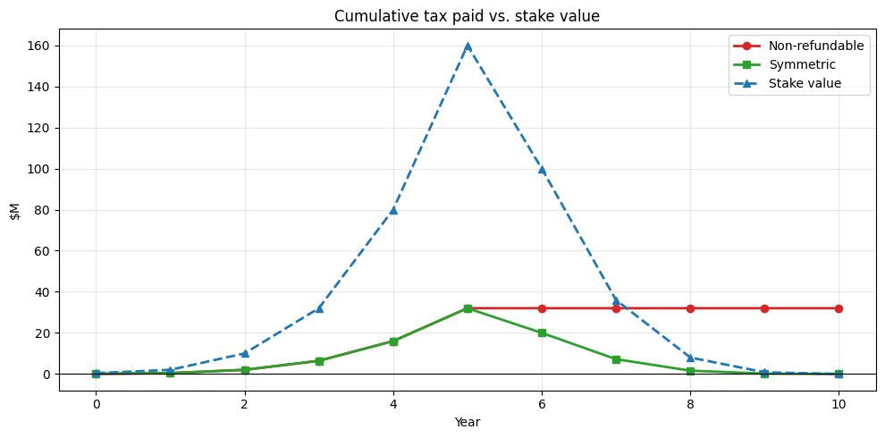
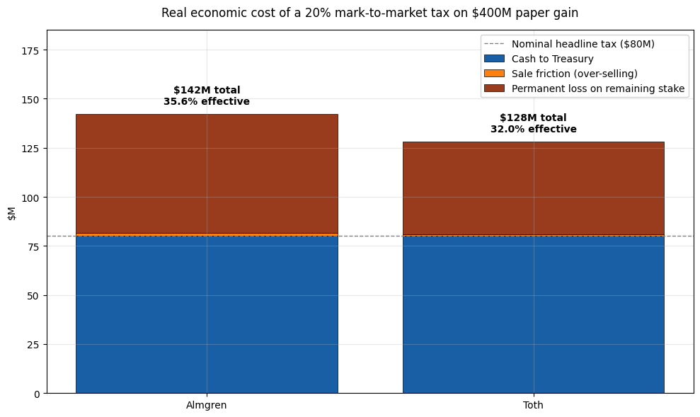

Capital gains are a huge share of the income of the wealthiest households, and
under current law gains are only taxed when an asset is sold. Buy-and-hold
investors can defer indefinitely, and the step-up in basis at death wipes a
lifetime of gains off the ledger. Taxing gains as they accrue closes that gap
... on paper. In practice, two cases tell a different story, one that turns out
very badly for people who should not be punished by our tax system. 

## Case 1 — The farmer next to a data center

Consider a family that runs a 4,000-acre row-crop operation. The corn they grow
pays what corn pays — about $600,000 of net cash income a year. Then, in year 3
of our simulatoin, a AI company announces a data-center campus 15 miles away.
Speculators bid the surrounding farmland from $10,000 to $30,000 an acre over
four years.

The farm's *real* activity hasn't changed. But on paper the farm is now worth
over $120M, well past a $50M wealth threshold. At a 20% mark-to-market tax on
the paper gain:

| Annual cash income | Worst-year tax | Tax ÷ income that year | 16-yr cum. tax | 16-yr cum. income | Acres to sell |
|---:|---:|---:|---:|---:|---:|
| $600k | $4.0M | 6.7× | $18.9M | $9.6M | 422 (11%) |

**The bad outcome:** there is no way to pay the tax from operations. To stay
current the family must sell off acres — probably to the same developer-class
buyer who caused the price spike. The policy *accelerates* the conversion of
family farmland into commercial use. And if the data-center plan falls through
and land prices drop, prior years' tax is not refunded.

[Walk through the farmer scenario →](/unrealized-gains-tax/farmer/)

## Case 2 — The founder of a failed startup

A founder owns 40% of her venture-backed startup. She paid roughly nothing for
her founder shares. The company raises priced rounds; by year 5 her stake is
paper-worth $160M, but this startup fails like most do, and by year 10 the
company has wound down and the stake is worth zero. Throughout, the shares are
*illiquid* — the cap table forbids secondary sales and her actual salary is
$250k.

Each up-round produces an unrealized "gain" that the tax bill is computed
against. Down-rounds produce paper losses, but they aren't refundable: at best
they roll forward against future gains that never arrive.

| Peak paper stake | Final stake | Total cash tax | Worst-year tax | Tax ÷ salary that year | Net outcome |
|---:|---:|---:|---:|---:|---:|
| $160M | $0 | $32M | $16M | 64× | −$32M |

**The bad outcome:** she pays tens of millions in real cash on paper money
against a stake that ends up worthless. The only way to pay the worst-year
bill is a forced partial sale of the company at the current paper mark —
which depresses that mark and triggers the same problem for everyone else
subject to the tax. The "symmetric" alternative — let the IRS refund losses —
is mathematically clean (net tax ≈ $0) but politically untenable: it requires
the Treasury to mail multi-million-dollar checks to wealthy households in
bust years.

[Walk through the entrepreneur scenario →](/unrealized-gains-tax/entrepreneur/)

## Case 3 — The public-company founder who has to move his own stock

A founder owns 20% of a publicly traded company with a $5B market cap. Over
one year the company grows to $7B — his paper gain is $400M and the 20% tax
is $80M. He has no other liquid wealth. To pay the tax he has to sell stock.

That's where the second-order math kicks in. A $5–7B-cap stock typically
trades about 0.7% of its market cap a day, so daily volume is around $30–50M.
Pushing $80M of insider supply through a stock like that is roughly **1.6
days of total volume**, and there is thirty years of empirical work on what
that does to price. Two serious bodies of literature disagree about the
functional form — [Almgren et al. (2005)](https://www.cis.upenn.edu/~mkearns/finread/costestim.pdf)
explicitly *reject* the square-root model in favor of a linear permanent /
3/5 temporary law; [Tóth et al. (2011)](https://arxiv.org/abs/1105.1694)
derive a square-root law from a latent-order-book model and support it
empirically. We compute under both. Both predict a permanent price drop in
the 3–5% range, applied not just to the shares he sells but to the ~19% of
the company he still holds.

| Model | Cash to Treasury | Sale friction | Permanent loss on remaining stake | **Total cost** | Effective rate on gain |
|:---|---:|---:|---:|---:|---:|
| Almgren (linear perm.) | $80.0M | $1.5M | $60.8M | **$142.3M** | **35.6%** (1.78× nominal) |
| Tóth (square-root perm.) | $80.0M | $1.0M | $47.1M | **$128.2M** | **32.0%** (1.60× nominal) |

**The bad outcome:** the headline 20% tax rate ends up being a 32–36%
effective rate on his paper gain, because the forced sale permanently
lowers the value of the stake he still holds. The permanent price drop is
also borne by every other shareholder — index funds, pension plans, retail.
A wealth tax on the founder is, in part, a value transfer from every other
holder of the same security to the Treasury. And it repeats every year the
company grows: ownership erodes monotonically.

[Walk through the public-company scenario →](/unrealized-gains-tax/public-company/)

## Why these aren't edge cases

Both stories follow from the same four mechanical properties of any annual
mark-to-market tax:

- **Liquidity:** the tax is owed in cash; the gain is on an asset that often
  cannot be sold.
- **Valuation:** for anything other than public stock, "this year's value" is
  an appraiser's opinion, not a market price.
- **Asymmetry:** taxing gains without refunding losses is a one-way ratchet;
  refunding losses turns the Treasury into a co-investor that writes checks
  during recessions.
- **Constitutional risk:** *Moore v. United States* (2024) left open whether
  unrealized gains are "income" within the 16th Amendment. A federal
  mark-to-market regime faces immediate litigation before it raises a dollar.

## The cleaner alternatives

- **Close step-up in basis at death.** Tax the embedded gain at the transfer
  event. Same revenue target, no annual valuation, no liquidity squeeze.
- **Tax loans against unrealized assets as constructive realization.** If a
  household borrows large sums against stock to fund consumption, treat that
  as a sale of the pledged shares for tax purposes.
- **Mark-to-market only publicly traded securities held by ultra-wealthy
  households.** Narrow base, observable prices, fewer cliff effects — still
  imperfect, but tractable.

None of this is an argument that the current system is fair. It's an argument
that "tax unrealized gains annually, across all asset classes" is the version
of the fix with the worst mechanical properties — and that the cleaner
reforms get most of the revenue with a fraction of the breakage.
