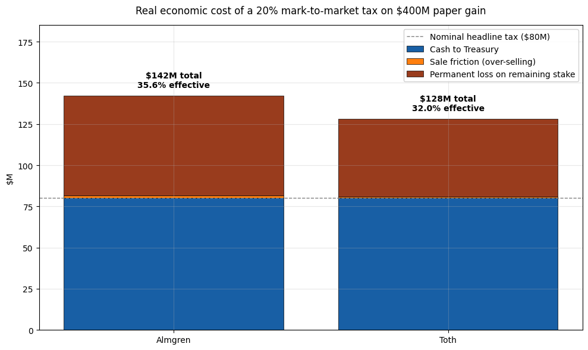
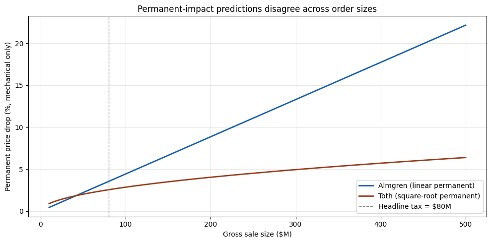
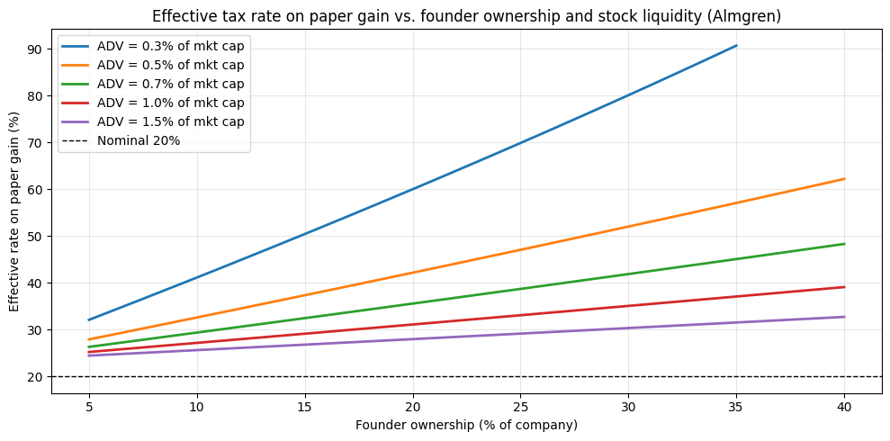
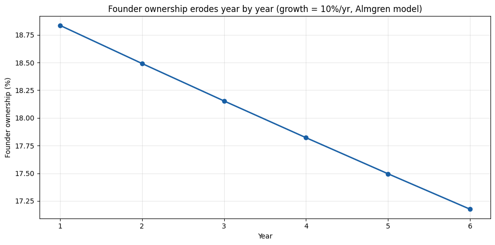

**Scenario.** A founder owns 20% of a publicly traded company with a market cap of \$5B. Over one year the company grows to \$7B. The founder's paper gain is \$400M and a 20% annual mark-to-market tax produces an \$80M cash bill. He has no other liquid wealth — his stake *is* his wealth.

He has to sell stock to pay the tax. The question this notebook tries to answer: **how much of the tax does he actually pay, once you include the price impact of forcing \$80M of insider supply through a stock that trades \$30–\$50M a day?**

Short version: the headline 20% tax rate on his paper gain ends up costing him 30–35% of the gain in real economic terms — about 1.5–1.7× the nominal rate — because every dollar of forced selling permanently lowers the value of the stock he still owns.

## A note on the model

Two serious bodies of empirical work disagree about the shape of the permanent-impact function. The qualitative story (forced selling produces nontrivial permanent value destruction) holds under both. The exact multiplier on the headline tax depends on which model you pick.

- **Almgren, Thum, Hauptmann & Li (2005)** — ~30k Citigroup institutional brokerage orders. They explicitly **reject** the square-root model. From their abstract: *"We reject the common square-root model for temporary impact as function of trade rate, in favor of a 3/5 power law across the range of order sizes considered."* For permanent impact they find a **linear** function of order size with a turnover correction:
$$I = \gamma\,\sigma\,\frac{X}{V}\left(\frac{\Theta}{V}\right)^{1/4}, \qquad J - \frac{I}{2} = \eta\,\sigma\left(\frac{X}{VT}\right)^{3/5}$$
with γ = 0.314, η = 0.142. *I* is the permanent price drop, *J* is the average realized cost on the trade, *X* is order size, *V* is daily volume, *Θ* is shares outstanding, *T* is execution duration in days, σ is daily volatility.

- **Tóth, Lemperière, Deremble, de Lataillade, Kockelkoren & Bouchaud (2011, Phys. Rev. X)** — derive a square-root impact law from a *latent order book* model and provide additional empirical support from CFM's own trade data. They build on a long line of earlier work (Loeb 1983; Barra 1997; Lillo, Farmer & Mantegna 2003, *Nature*; Bouchaud, Gefen, Potters & Wyart 2004) that found concave power-law impact, often consistent with $\sqrt{X/V}$. The square-root law is widely treated as the industry workhorse.

We compute under **both models** and present them side by side. They disagree by roughly 2× on the permanent impact at our headline order size, which is why we don't claim a single "right" effective tax rate.

Both papers' calibrations are based on orders ≤ a few percent of daily volume. Our scenario pushes orders of ~160% of daily volume — well outside both calibration ranges. The numbers below should be read as order-of-magnitude estimates, not precise predictions.

## Step 1 — the headline tax bill

    Founder stake at year start:    $  1,000,000,000
    Founder stake at year end:      $  1,400,000,000
    Paper gain on the year:         $    400,000,000
    Tax owed at 20%:                $     80,000,000

## Step 2 — how big is that sale relative to normal trading?

    Average daily dollar volume:      $     49,000,000
    Volume over 60-day horizon:        $  2,940,000,000
    
    Tax bill as % of company:                   1.14%
    Tax bill in days of volume:                   1.6 days
    Tax bill as % of horizon volume:            2.72%
    
    Rule 144 1%-of-shares cap:          $   70,000,000
    Rule 144 weekly-volume cap:         $  245,000,000
    Effective Rule 144 cap (greater):   $  245,000,000
    Tax bill / Rule-144 cap:                       0.33x  (>1 means more than one quarter required)

## Step 3 — price impact under the Almgren and Tóth models

Note the model choice: Almgren's permanent impact is **linear** in order size, not square-root. The 3/5 exponent shows up only in temporary impact. For comparison we also compute a Tóth-style square-root model. Both add a 1% permanent insider-signaling discount on top of the mechanical impact.

    Almgren (linear perm, 3/5 temp):  permanent =  4.54%,  realized cost J =  1.81%
    Toth    (square-root perm)    :  permanent =  3.56%,  realized cost J =  1.28%

## Step 4 — gross sale needed to *net* the tax owed

Selling pushes the price down during execution, so the founder must sell more than \$80M of stock at pre-trade prices to net \$80M of cash. Solve for the gross sale `Q` such that `Q × (1 − J(Q)) = $80M` under each model.

    --- Almgren model ---
      Gross stock sold:    $    81,498,415
      Friction (Q - tax):  $     1,498,415
      Realized cost J:              1.84%
      Permanent impact:             4.61%
    
    --- Toth model ---
      Gross stock sold:    $    81,042,243
      Friction (Q - tax):  $     1,042,243
      Realized cost J:              1.29%
      Permanent impact:             3.57%
    

## Step 5 — the loss on the shares he still holds

After the sale, the permanent impact stays in the stock price. His *remaining* shares are worth permanently less. That value destruction is not on his tax return, but it is the largest hidden cost of this whole exercise.

    --- Almgren ---
      Ownership sold:                 1.16% of company
      Remaining ownership:            18.84%
      Remaining stake pre-impact:     $ 1,318,501,585
      Remaining stake post-impact:    $ 1,257,704,301
      Value destroyed on remainder:   $    60,797,284
    
    --- Toth ---
      Ownership sold:                 1.16% of company
      Remaining ownership:            18.84%
      Remaining stake pre-impact:     $ 1,318,957,757
      Remaining stake post-impact:    $ 1,271,843,280
      Value destroyed on remainder:   $    47,114,477
    

## Step 6 — total economic cost vs. headline tax bill

      Model  Cash to Treasury ($M)  Sale friction ($M)  Permanent loss on remaining stake ($M)  Total cost ($M) Effective rate on gain Multiple of nominal
    Almgren                   80.0            1.498415                               60.797284       142.295699                  35.6%               1.78x
       Toth                   80.0            1.042243                               47.114477       128.156720                  32.0%               1.60x

## Charts

    

    

    

    

    

    

     Year  Mkt cap end ($M)  Ownership (%)  Tax owed ($M)  Economic cost ($M)  Eff. rate on gain (%)
        1            7000.0           18.8           80.0               142.3                   35.6
        2            7540.8           18.5           26.4                56.0                   42.4
        3            8124.9           18.2           27.9                58.9                   42.2
        4            8756.1           17.8           29.5                62.0                   42.0
        5            9438.0           17.5           31.2                65.2                   41.8
        6           10175.1           17.2           33.0                68.7                   41.6

    

    

## Takeaways

1. **The \$80M nominal tax bill costs the founder \$120M–\$140M in real economic terms**, depending on which empirical impact model you use. Either way the hidden value-destruction on his remaining stake is comparable to or larger than the cash paid to the Treasury.
2. **The effective tax rate on his paper gain is ~30–35%, not 20%.** And it climbs sharply as the company gets smaller, the founder owns more, or the stock is less liquid — exactly the households the proposal is supposed to target.
3. **The model uncertainty is real.** Almgren et al. (2005) reject the square-root law; Tóth et al. (2011) derive it from a latent-order-book model. Both are serious empirical work. Our scenario (~160% of daily volume in a single tax year) is well outside both papers' calibration ranges. The *qualitative* story is robust to model choice; the precise multiplier on the headline tax is not.
4. **Rule 144 doesn't bind for a normally liquid \$5–7B stock** (the weekly-volume cap is roughly \$245M, comfortably above the \$80M sale). But it *does* bind for thinly traded names: cut ADV below ~0.3% of market cap and the founder runs out of legal selling capacity inside one quarter.
5. **Other shareholders pay too.** The permanent price drop applies to *everyone* who owns the stock — index funds, pension plans, retail. A wealth tax on the founder is, in part, a value transfer from every other holder of the same security to the Treasury.
6. **Compounding.** If the company keeps growing, the same dance repeats every year. Ownership erodes monotonically; the founder loses control of the company on a fixed schedule independent of business performance.

## Caveats

- **Almgren et al. (2005) explicitly reject the square-root law** for temporary impact (β = 0.600 ± 0.038 vs. 1/2), and find permanent impact *linear* in order size with a (Θ/V)^¼ turnover correction. We use their actual functional form here, not the "square root" caricature sometimes attributed to them.
- The square-root law is well-supported by a *separate* and equally serious body of work — most prominently **Tóth et al. (2011, Phys. Rev. X)**, which derives it from a latent-order-book mechanism. Earlier supporting work includes Loeb (1983), Barra (1997), Lillo, Farmer & Mantegna (2003), and Bouchaud, Gefen, Potters & Wyart (2004). We compute under both models and show the disagreement.
- The +1% insider-signaling permanent discount is a stylized addition above mechanical impact. Pre-announced 10b5-1 plan sales attract less; surprise insider supply attracts more.
- Both calibrations are for orders ≤ a few percent of daily volume. Our scenario is at ~160% of daily volume. Read the numbers as order-of-magnitude estimates, not point predictions.

## Sources

- Almgren, R., Thum, C., Hauptmann, E., & Li, H. (2005). *Direct estimation of equity market impact.* ([PDF](https://www.cis.upenn.edu/~mkearns/finread/costestim.pdf)) — fits linear permanent impact, **rejects** the square-root model for temporary impact in favor of β = 3/5.
- Tóth, B., Lemperière, Y., Deremble, C., de Lataillade, J., Kockelkoren, J., & Bouchaud, J.-P. (2011). *Anomalous price impact and the critical nature of liquidity in financial markets.* Phys. Rev. X 1, 021006. ([arXiv 1105.1694](https://arxiv.org/abs/1105.1694)) — derives the square-root law from a latent-order-book mechanism.
- Lillo, F., Farmer, J. D., & Mantegna, R. N. (2003). *Master curve for price-impact function.* Nature 421, 129–130.
- Bouchaud, J.-P., Gefen, Y., Potters, M., & Wyart, M. (2004). *Fluctuations and response in financial markets.* Quantitative Finance 4(2), 176–190.
- Frazzini, A., Israel, R., & Moskowitz, T. (2018). *Trading costs.* AQR working paper. ([SSRN 3229719](https://papers.ssrn.com/sol3/papers.cfm?abstract_id=3229719)) — \$1.7T of live trade data, finds real-world trading costs an order of magnitude lower than prior literature.
- SEC Rule 144 — selling restricted and control securities ([SEC.gov](https://www.sec.gov/reports/rule-144-selling-restricted-control-securities)).

---

*The simulation above is generated by [`public_company.ipynb`](https://github.com/ericbusboom/explainers/blob/master/content/posts/unrealized-gains-tax/public-company/public_company.ipynb). View the notebook on GitHub to inspect or run the code.*
